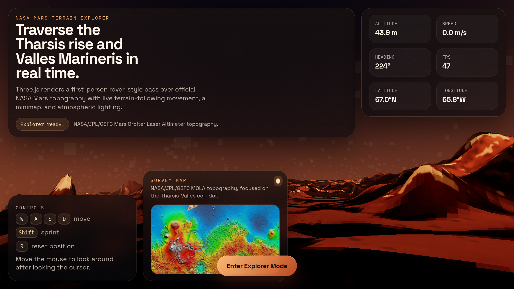

# Mars Terrain Explorer

An atmospheric Three.js + React experience that lets you traverse the Tharsis rise and Valles Marineris in real time.

## Getting Started

```bash
npm install
npm run dev
```

Then open the local Vite URL shown in the terminal.

## Available Scripts

```bash
npm run dev
npm run build
npm run preview
```

## What It Does

- Renders a first-person Mars terrain scene with Three.js.
- Shows live terrain-following movement and camera controls.
- Includes a survey map card and HUD-style telemetry.
- Focuses on NASA/JPL/GSFC Mars topography data and presentation.

## Screenshot




## Project Structure

```text
src/
  App.jsx
  main.jsx
  styles.css
  lib/marsExplorer.js
```

## Notes

This project is built with Vite, React, and Three.js. The build output goes to `dist/`, which is already ignored by git.
